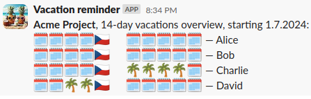

# Vacation reminder

<div align="center">
  
</div>

Receive Slack notifications for upcoming vacations in your team!
- Run on Google Apps Script (DIY deployment)
- Manage teams and subscribers in Google Sheets
- Receive weekly notifications about upcoming vacations
- Includes public holiday info


Example message:

<div align="center">

</div>


## Development

Final Apps Script app consists of `dist/app.js` and `index.gs`.
- `dist/app.js` is built from `src` via `npm run build`,
- `index.gs` is a bootstrap file, create it from `index.template.gs`.

### Release a new version
```
npm run build && clasp push && clasp deploy --description DEPLOYMENT_DESCRIPTION --deploymentId DEPLOYMENT_ID
```
Example:
```
npm run build && clasp push && clasp deploy --description "Fix startup crash" --deploymentId AKf...6dQ
```

### Testing

Run unit tests with `npm t`.